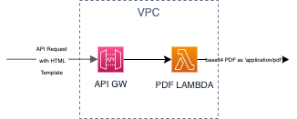
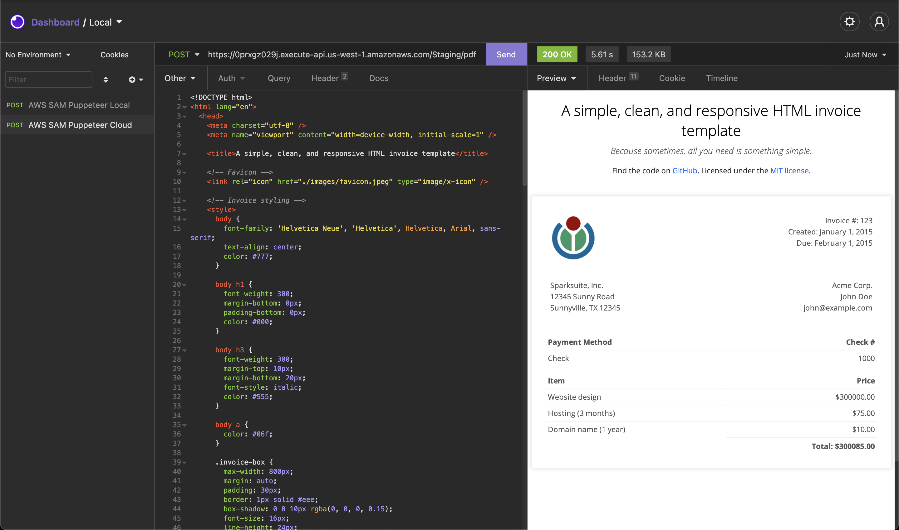

# Generate PDF document via Puppeteer running on AWS Lambda

This repo contains a serverless application that takes a HTML template and return a PDF in form of a binary

### Diagram

# Requirements

- [Docker](https://docs.docker.com/get-docker/)
- [AWS SAM](https://docs.aws.amazon.com/serverless-application-model/latest/developerguide/serverless-sam-cli-install.html)
- [AWS Console Account && API Keys](https://docs.aws.amazon.com/cli/latest/userguide/cli-configure-files.html)

# How to Run

1. Clone this repo `git clone https://github.com/zahaar/generate-pdf-lambda`

2. Import [cUrl](./cUrl.txt) to [Insomnia](https://insomnia.rest/) ( Postman is not recommended, as it can't visualize Pdf ).
3. Run `make api-local` to have local API GW running.
4. Send `cUrl` request via Insomnia.

> You can also invoke Lambda bypassing API GW, by supplying an example event in [file](/events/api-gw-event.json), and running `make invokation-local`. The response would be a base64 encoded PDF binary.

# How to Deploy

> A configured AWS CLI V2 is a must -> [AWS Console Account && API Keys](https://docs.aws.amazon.com/cli/latest/userguide/cli-configure-files.html)

1. `make deploy`

2. Fetch AWS SAM deploy output URL `Value`, and change the Url in Insomnia from `localhost` to that value.
   _execution result in Insomnia_
   

# Improvements

- Add Authorization Layer to API GW.
- Configure API GW rate limits and throttling.
- Enable API GW cache.
